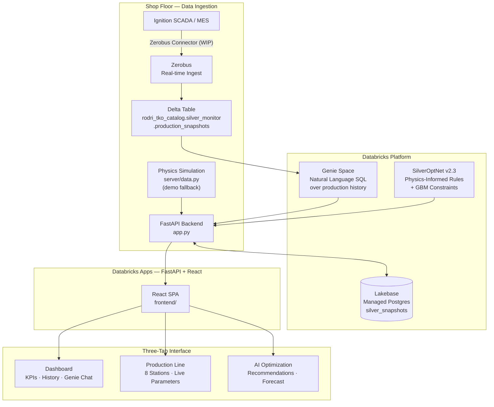

# Silver Consumption Monitor

A real-time monitoring, analytics, and AI-optimization dashboard for silver consumption on mirror production lines — built entirely on Databricks.

> **Demo context:** Saint-Gobain ASK mirror line · 4.5M m²/year · 2–8mm glass

---

## Overview

Mirror manufacturing relies on a chemical silver deposition process where precise control of silver consumption is critical — both for product quality and cost. A deviation of just 10% above nominal can represent significant material waste at scale.

This application provides production line managers and operators with:
- **Real-time KPIs** updated every 5 seconds
- **Historical trend analysis** with shift-aware patterns
- **Production line visualization** showing all 8 stations with live coating parameters
- **AI-driven optimization recommendations** from a physics-informed model (SilverOptNet v2.3)
- **Natural language data exploration** via Databricks Genie

---

## Architecture



### Data Ingestion (WIP)

In a production deployment, live sensor data from **Ignition SCADA** (the MES system on the shop floor) would flow into Databricks via a **Zerobus connector** — providing near-real-time ingestion into the `production_snapshots` Delta table. The Genie space and historical chart would then reflect actual production data with minimal latency.

For this demo, `server/data.py` implements a physics-inspired simulation of the silver deposition process, including realistic shift patterns, maintenance windows, and parameter noise.

---

## Business Value

| Pain Point | Solution |
|---|---|
| Operators can't tell if consumption is abnormal until end-of-shift | Real-time deviation alert (±10% threshold) with 5s refresh |
| Managers can't query production history without SQL expertise | Genie natural language interface over Delta table |
| No systematic way to know which parameter to adjust first | SilverOptNet ranks adjustments by expected savings % |
| Historical data lost on app restart / not shared across users | Lakebase persists every snapshot; all users see the same history |
| Silver waste is invisible until weekly cost reports | Daily silver consumed (grams) shown live on the dashboard |

**At 4.5M m²/year, a 5% reduction in average silver consumption (e.g., from recommendations) represents significant annual material savings.**

---

## Databricks Differentiators

### 1. Databricks Apps — Zero-Infrastructure Hosting
The entire application (FastAPI backend + React SPA) runs natively on Databricks with no external cloud services. Authentication, scaling, and secrets injection are handled by the platform. The app's service principal automatically inherits workspace permissions.

### 2. Lakebase — Operational Database, Native to the Lakehouse
Lakebase (managed Postgres) stores every production snapshot written by the app. Unlike Delta tables (optimized for analytical batch queries), Lakebase provides:
- Sub-100ms point reads/writes for the real-time dashboard
- Always-on (no warehouse cold-start latency)
- OAuth token-based auth — same identity as the rest of the platform
- Data accessible from both the app and the lakehouse (CDC-ready)

### 3. Genie — Natural Language SQL for Operators
The Genie Data Assistant is backed by the `production_snapshots` Delta table in Unity Catalog. Operators can ask questions like *"When was consumption more than 20% above nominal last week?"* without writing SQL. Genie generates, executes, and explains the query inline.

### 4. Unity Catalog — Governed Data Access
The production data table lives in Unity Catalog (`catalog.schema.table`), giving full lineage tracking, access control, and auditability. The same table powers both the Genie space and could feed downstream ML pipelines or AI/BI dashboards.

### 5. Zerobus — Real-time Ingestion (WIP)
The intended production architecture uses a **Zerobus connector from Ignition** to stream live MES/SCADA data directly into the Delta table, bridging the OT/IT gap without custom ETL infrastructure.

---

## Features

### Dashboard Tab
- Live KPI cards: silver consumption, deviation %, silver per minute, throughput, daily total
- Status badge: Optimal / High / Low with animated pulse indicator
- Historical area chart with 6h / 12h / 24h / 48h window selector
- Parameter impact ranking (line speed, bath temperature, etc.)
- **Genie Data Assistant** — conversational interface with tabular results and SQL inspection

### Production Line Tab
- 8-station horizontal flow diagram (Glass Input → Cleaning → **Silver Coating** → Paint → Curing → Cooling → Unloading → Cutting)
- Animated conveyor belt with sliding glass sheets
- Station 3 (Silver Coating) highlighted with live consumption and deviation
- Live parameter gauges for all 6 coating parameters, refreshed every 5s
- Station overview grid with process descriptions

### AI Optimization Tab (SilverOptNet v2.3)
- Model metadata: GBM + Physics-Informed Constraints, trained on 94,320 samples
- Confidence score and estimated savings potential
- Up to 4 prioritized parameter recommendations with current → target values and expected impact %
- Live vs Optimal chart: 2h of actual consumption (blue) vs model optimal (green) with savings gap shaded
- 30-minute forecast trajectory if recommendations are applied

---

## Tech Stack

| Layer | Technology |
|---|---|
| Hosting | Databricks Apps |
| Backend | Python 3.9, FastAPI, Uvicorn |
| Database | Databricks Lakebase (asyncpg) |
| Analytics | Databricks Genie, Unity Catalog Delta tables |
| AI/ML | Physics-informed optimization (SilverOptNet) |
| Frontend | React 18, TypeScript, Vite, Recharts, Lucide |
| Auth | Databricks SDK (dual-mode: CLI locally, service principal on Apps) |

---

## Local Development

### Prerequisites
- Python 3.9+
- Node.js 18+
- [Databricks CLI](https://docs.databricks.com/dev-tools/cli/index.html) authenticated against your workspace
- A Databricks workspace with Genie enabled (for the chat feature)

### Backend
```bash
cd tko_app
python -m venv .venv && source .venv/bin/activate
pip install -r requirements.txt

export DATABRICKS_PROFILE=your-profile   # matches ~/.databrickscfg
uvicorn app:app --reload --port 8000
```

### Frontend
```bash
cd frontend
npm install
npm run dev   # Vite dev server on :5173, proxies /api → :8000
```

### Environment variables (local)
The app reads Genie configuration from environment variables. For local development, set:
```bash
export GENIE_SPACE_ID=your-genie-space-id
```

---

## Deployment to Databricks Apps

### 1. Create the Genie space
Using the Databricks UI or AI Dev Kit, create a Genie space backed by a Delta table with the schema in `server/db.py`. Set the space ID in `app.yaml`.

### 2. Build the frontend
```bash
cd frontend && npm run build
```

### 3. Sync source files
```bash
databricks sync . /Workspace/Users/you@example.com/silver-monitor \
  --exclude node_modules --exclude .venv --exclude __pycache__ \
  -p your-profile
```

### 4. Upload built frontend
```bash
databricks workspace import-dir frontend/dist \
  /Workspace/Users/you@example.com/silver-monitor/frontend/dist \
  --overwrite -p your-profile
```

### 5. Deploy
```bash
databricks apps deploy silver-monitor \
  --source-code-path /Workspace/Users/you@example.com/silver-monitor \
  -p your-profile
```

### 6. Add resources (Databricks Apps UI)
After first deploy, go to **Compute → Apps → silver-monitor → Edit** and attach:
- **Database** resource → your Lakebase instance → `Can connect`
- **Genie space** → your space → `Can use` (optional, for access control)

Redeploy to pick up the injected `PGHOST`, `PGPORT`, `PGDATABASE`, `PGUSER` environment variables.

---

## Configuration (`app.yaml`)

```yaml
env:
  - name: GENIE_SPACE_ID
    value: YOUR_GENIE_SPACE_ID        # ID of your Genie space

  # Injected automatically when Lakebase resource is attached:
  - name: PGHOST
    valueFrom: database
  - name: PGPORT
    valueFrom: database
  - name: PGDATABASE
    valueFrom: database
  - name: PGUSER
    valueFrom: database
```

---

## Project Structure

```
tko_app/
├── app.py                          # FastAPI entry point + routes
├── app.yaml                        # Databricks Apps config
├── requirements.txt
├── server/
│   ├── config.py                   # Dual-mode Databricks auth
│   ├── data.py                     # Physics simulation (demo mode)
│   ├── db.py                       # Lakebase connection pool
│   ├── llm.py                      # Foundation Model API client
│   └── routes/
│       ├── chat.py                 # POST /api/chat → Genie
│       └── optimize.py             # POST /api/optimize → SilverOptNet
└── frontend/
    ├── src/
    │   ├── App.tsx                 # Root + tab navigation
    │   └── components/
    │       ├── RealtimePanel.tsx   # Live KPI cards
    │       ├── HistoricalChart.tsx # Recharts area chart
    │       ├── ParameterImpact.tsx # Impact bar chart
    │       ├── AiAssistant.tsx     # Genie chat UI
    │       ├── ProductionLine.tsx  # Station flow diagram
    │       └── OptimizationPanel.tsx # AI recommendations + forecast
    ├── package.json
    └── vite.config.ts
```

---

## Demo Notes

- **Simulation mode**: If `PGHOST` is not set (Lakebase not attached), the app falls back to in-memory simulation for all data. All features remain functional.
- **Genie fallback**: If `GENIE_SPACE_ID` is not set, the chat panel returns an error with a clear message.
- **SilverOptNet**: The optimization model is deterministic and rule-based — no external ML serving endpoint required. In a production scenario, this would call a Databricks Model Serving endpoint trained on real process data.
